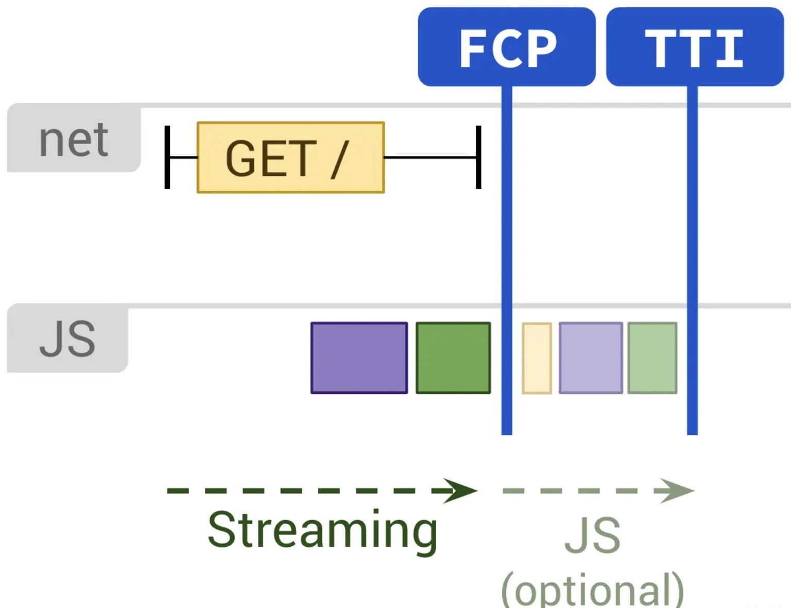
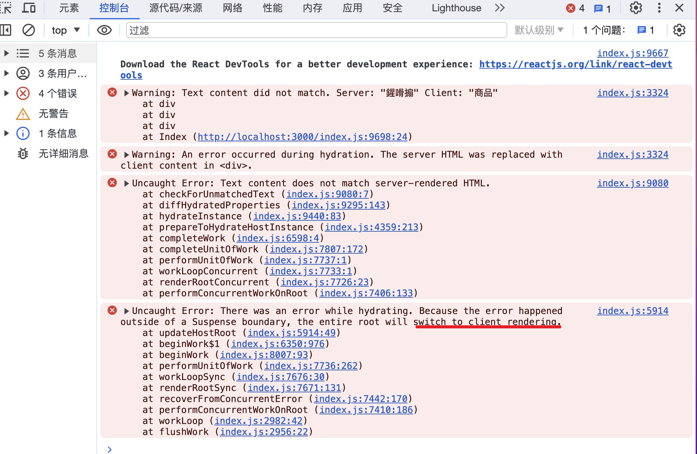
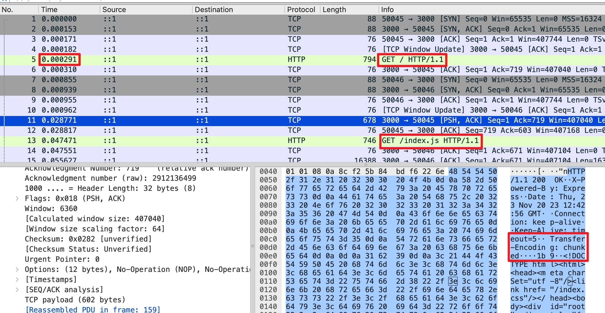
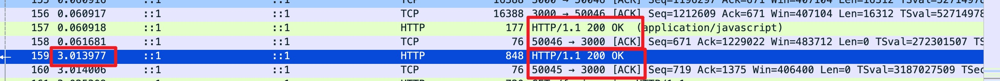

```
.
├── README.md
├── build
│   └── index.js
├── package.json
├── pnpm-lock.yaml
├── public
│   └── index.css
├── rollup.config.mjs
├── server
│   └── render.js
├── server.entry.js
└── src
    ├── App.jsx
    ├── html.jsx
    └── index.jsx
```
主要参考了：<br>
[”渐进式页面渲染“：详解 React Streaming 过程](https://juejin.cn/post/7248606482014896185)<br>
[从 新的 Suspense SSR 聊到 HTTP 分块传输](https://juejin.cn/post/7083329781919383588)<br>


# 本地运行项目
1. `pnpm i`安装环境。
2. `pnpm run dev:client`打包客户端代码`src/index.jsx`到文件夹`build`。
3. 本地运行`pnpm run dev:server`，启动项目。

# 服务端渲染流程（实验探究，之后会画个图说明整个过程）
1. 服务调用流程：打开客户端`localhost:3000`访问时，服务端`server.entry.js`提供服务，`/`路径对应服务调用`server/render.js`，对于这次请求`render.js`返回服务端渲染生成的`html`代码块。
2. 服务端渲染流程：`render.js`中，先去请求数据（使用setTimeout+Promise耗时3s）`comments`，此时会等待3s（页面会有3s的空白），再调用库`react-dom/server`中的API`renderToString`，以`/src/html.jsx`、`/src/App.jsx`React组件为原料生成`html`代码块。<br>

3. `html`代码块中，数据挂载：`render.js`中将数据`comments`传递给`/src/html.jsx`后，`/src/html.jsx`中有挂载`comments`数据的script标签（如下代码），在`render.js`生成的`html`代码块中有`<script dangerouslySetInnerHTML={{
    __html: window.__diy_ssr_context=['This is Great.', 'Worthy of recommendation!']
  }}></script>`，返回给前端。
```html
<body>
  <div id='root'>{children}</div>
  <script dangerouslySetInnerHTML={{
    __html: `window.__diy_ssr_context=${JSON.stringify(comments)}`
  }}></script>
  <script src="/index.js">
  </script>
</body>
```

4. `html`代码块中，客户端`hydrate`代码挂载：
* 客户端hydrate代码打包：`pnpm run dev:client`打包hydrate相关代码`src/index.jsx`到文件夹`build/index.js`。
* 客户端hydrate代码挂载：在`/src/html.jsx`中使用script标签去请求hydrate相关代码，在`render.js`生成的`html`代码块中有`<script src="/index.js"></script>`。

5. 客户端加载渲染：客户端获取到`html`代码块后，从上向下解析`html`代码块，执行到`<script dangerouslySetInnerHTML`，将数据挂载到`window.__diy_ssr_context`中，执行到`<script src="/index.js">`，去请求运行`/index.js`静态文件来开始hydrate。

6. 客户端进行hydrate。客户端请求`/index.js`静态文件，`server.entry.js`服务取出`build/index.js`文件返回，客户端获取后执行完成hydrate。<br>
`build/index.js`原文件对应4中所述`src/index.jsx`，即`hydrate`相关代码，如下：<br>
```javaScript
import React, { startTransition } from 'react'
import { hydrateRoot } from 'react-dom/client'
import App from './App'

startTransition(() => {
  setTimeout(() => {
    hydrateRoot(document.getElementById('root'),<App comments={window.__diy_ssr_context} />)
  }, 10000)
})
```
从代码中可以看出，`hydrate`代码中，包括`react-dom/client`的`hydrateRoot`这一API、挂载位置`#root`、待hydrate挂载的组件`APP`、`APP`组件渲染时使用的数据`window.__diy_ssr_context`。<br>
要注意：
* 客户端hydrate要渲染的App组件同服务端`render.js`生成`html`时用的App组件，两者都来自于`/src/App.jsx`，即同一组件供客户端渲染、服务端渲染两次使用。
* 客户端hydrate在渲染APP组件时，使用的数据`window.__diy_ssr_context`同在服务端`render.js`渲染APP组件时使用的数据。
* 同一数据源、同一组件源保证了客户端渲染生成的关于APP的 `html`片段同服务端`render.js`生成的，这样hydrate才可以成功的给页面绑定事件，之后页面才是可以交互。

需要关注的性能指标：

<br>图片来自：https://web.dev/articles/rendering-on-the-web

* 首次内容绘制时间（First Contentful Paint，FCP）：由于服务端`render.js`获取数据`comments`需要用时3s（代码如下），服务端`render.js`至少需要等待3s才会生成`html`代码块，即用户前3s看到是空白页，首屏加载时间(FCP)是大于等于3s的。
```javascript
function getComments() {
  return new Promise((resolve) =>
    setTimeout(() => {
      resolve(['This is Great.', 'Worthy of recommendation!']);
    }, 3000)
  );
}

export default async function render(res) {
  const comments = await getComments();
```
* 首次可交互时间（Time to Interactive，TTI）：客户端接收到hydrate相关的代码（src/index.jsx）如下，需要再等10s才开始进行hydrate，因此从用户发起请求到用户可与APP组件相关的页面交互的时间（即TTI）至少是`3+10=13s`。
```javascript
startTransition(() => {
  setTimeout(() => {
    hydrateRoot(document.getElementById('root'),<App comments={window.__diy_ssr_context} />)
  }, 10000)
})
```

# Suspense SSR（渐进式页面渲染-React Streaming）

在`src/html.jsx`中，要添加`<meta charSet="utf-8" />`，否则会报如下错误：<br>
<br>

渐进式页面渲染与服务端渲染流程的不同之处在于，服务端不用一次性渲染整个HTML，可以将整个HTML切分成一段一段的，分批次的传给客户端进行渲染。<br>

Suspense SSR在技术上使用React的renderToPipeableStream、Suspense、use hook实现。<br>

## 渐进式页面渲染的流程如下：
1. 服务调用流程：打开客户端`localhost:3000`访问时，服务端`server.entry.js`提供服务，`/`路径对应服务调用`server/render.js`，对于这次请求`render.js`返回服务端渲染生成的`html`代码块。
2. 服务端渲染流程：`render.js`中，会去请求数据`comments`（使用setTimeout+Promise耗时3s），调用库`react-dom/server`中的API`renderToPipeableStream`，以`/src/html.jsx`、`/src/App.jsx`React组件为原料生成`html`代码块。<br>
注意：此时服务端`render.js`会立刻渲染生成、返回`html`代码块，并不会等待3s先去请求到`comments`数据。
* 在`/src/App.jsx`中，会把使用到`comments`数据的代码块`<Comments comments={commentsPromise} />`，用`<Suspense fallback={<div>Loading...</div>}></Suspense>`包裹起来，在`render.js`进行服务端渲染时，`<Suspense ...>...</Suspense>`会使用`fallback`代码块完成渲染（此时`render.js`返回给客户端的`html`没有`<Comments...`的内容），待3s后请求到`comments`数据，再把`<Comments commentsPromise={comments} />`渲染成html片段并添加上`<script>js代码</script>`传递给客户端，客户端运行js代码替换掉原`fallback`代码（后面会有实验验证`renderToPipeableStream`的这个流程）。

* 在<Comments ... />的组件定义中，会使用到`use hook`，即`const comments = use(commentsPromise);`，如下代码。(`use hook`会将加载时状态以及错误处理委托给最近的 `Suspense`)
```javascript
function Comments({comments}) {
  const commentsResult = use(comments);
  return Array.isArray(commentsResult) && commentsResult.map(comment => {
    return  <p key={comment}>{comment}</p>;
  })
}
```

3. `html`代码块中，数据挂载：由于服务端`render.js`不等待请求到数据`comments`就渲染、返回`html`代码块，因此此时客户端接收到的`html`代码块中一定不包含`hydrate`阶段使用到的数据。为解决该难题可以同`2`中一样，使用`use hook`、`Suspense`等待3s后再向客户端传递数据，具体见文件`src/html.jsx`，关键代码片段如下：<br>
```javascript
function CommentsScript({comments: commentsPromise}) {
  const comments = use(commentsPromise);
  return <script dangerouslySetInnerHTML={{
    __html: `window.__setComments_data(${JSON.stringify(comments)})`
  }}></script>
}
export default ({children,comments}) => {
  return <html>
    ...
    <body>
      <div id='root'>{children}</div>
      <script src="/index.js" />
      <Suspense>
        <CommentsScript comments={comments}></CommentsScript>
      </Suspense>
    </body>
  </html>
}
```
* 注意到：在3s后，`CommentsScript`组件会等到`comments`数据，传递给客户端一个`script`标签(innerHTML带有`comments`数据)，客户端会执行`script`标签中的JS代码，JS代码中会以`comments`数据为实参执行`__setComments_data`函数（函数的定义在`hydrate`代码块中），而非把`comments`数据直接赋值给一个全局变量，是因为浏览器在解析`render.js`返回的`html`代码块时，解析到`hydrate`相关代码时，要等待`comments`数据的到来，这里`__setComments_data`函数的作用就是通知`hydrate`，数据已经到来可以继续`hydrate`的后续工作了。`hydrate`相关代码块如下：
``` javascript
// src/index.jsx文件。
// 客户端渲染使用的APP组件同服务端渲染，见src/App.jsx。
const clientPromise = new Promise((resolve) => {
  window.__setComments_data = (comments) => resolve(comments)
})

startTransition(() => {
  setTimeout(
    () => {
      hydrateRoot(document.getElementById('root'), <App comments={clientPromise} />)
    },
    5000
  );
})

// 在src/App.jsx中，会把clientPromise传给Comments组件的use hook，客户端hydrate时在这里等待comments数据的到来，如下，clientPromise变成resolve状态后会完成后续的hydrate工作。
function Comments({comments}) {
  const commentsResult = use(comments);
  return Array.isArray(commentsResult) && commentsResult.map(comment => {
    return  <p key={comment}>{comment}</p>;
  })
}
```

4. `html`代码块中，客户端`hydrate`代码挂载：
* 客户端hydrate代码打包：`pnpm run dev:client`打包hydrate相关代码`src/index.jsx`到文件夹`build/index.js`。
* 客户端hydrate代码挂载：在`/src/html.jsx`中使用script标签去请求hydrate相关代码，在`render.js`生成的`html`代码块中有`<script src="/index.js" />`。

5. 客户端加载渲染：客户端获取到`html`代码块后，从上向下解析`html`代码块，执行到`<script src="/index.js">`，去请求运行`/index.js`静态文件来开始hydrate。

6. 客户端进行hydrate。客户端请求`/index.js`静态文件，`server.entry.js`服务取出`build/index.js`文件返回，客户端获取后执行完成hydrate。
* 客户端在hydrate到`App`组件时，会传`clientPromise`给子组件`Comments`，此时`clientPromise`处于pending状态，子组件`Comments`会处于阻塞hydrate的状态。
* 3s后，在后端服务器中，获取到`comments`数据，原src/html.jsx中`<Suspense><CommentsScript..`开始渲染`CommentsScript`组件为html片段（`comments`数据），传递给客户端，客户端解析该html片段时，会执行到`script`标签中的JS代码，JS代码把`clientPromise`变为`Promise.resolve(comments数据)`，客户端中`App`组件的子组件`Comments`不再阻塞并获取到`comments`数据，进行后续的hydrate（本文`3`中的注意部分也有该流程的相关介绍）。

## 分块传输实验
从用户在客户端发起请求到最后完成`hydrate`的整个流程中，服务端共有两次向客户端传输`html`片段，第一次传输`render.js`渲染出的整个页面的`html`，第二次传输3s后请求到`comments`数据时渲染出的`<Suspense...`对应`html`片段，二次传输其底层实际使用的是http的分块传输技术，这里使用wireshark进行抓包实验，验证该过程。



<br>

* `0.000291`时刻，用户在客户端发起`localhost:3000`请求时(`Src Port:50045, Dst Port:3000`)，使用的是`http1.1`协议，
* 从`0.028771`时刻的TCP报文来看，这次(`Src Port:50045, Dst Port:3000`)的分块传输使用了`http1.1`协议的`Transfer-Encoding: chunked`。
* `0.0474471`时刻，客户端开始发起`localhost:3000/index.js`请求(`Src Port:50046, Dst Port:3000`)，去请求`hydrate`相关代码，对应文件位于服务端`build/index.js`。
* `0.060918`时刻，服务端返回`build/index.js`文件给客户端。
* `3.013977`时刻，服务端结束`Transfer-Encoding: chunked`的分块传输。
<br>
从[当 Transfer-Encoding: chunked 遇上 HTTP2](https://zhuanlan.zhihu.com/p/598820668)来看，在http2中并不能使用`renderToPipeableStream`，可以尝试使用Nignx在中间转一下（但还没有验证）。

## 可用的链接：<br>


[Web前端最新优化指标：FP、FCP、LCP、CLS、TTI、FID、TBT、FMP等](https://www.cnblogs.com/gg-qq/p/16178277.html)<br>

使用wireshark抓包：<br>
[Macos下的wireshark抓包权限不足问题](https://codeantenna.com/a/pRXs0yMrHD)<br>
[45张图带你从入门到精通学习WireShark！](https://juejin.cn/post/7140935564827557896?searchId=202311221617565FD8473E973707133303)<br>


HTTP2问题：<br>
[当 Transfer-Encoding: chunked 遇上 HTTP2](https://zhuanlan.zhihu.com/p/598820668)<br>
[HTTP2 下的 Transfer-Encoding: chunked](https://kiosk007.top/post/http2-%E6%94%AF%E6%8C%81%E5%88%86%E5%9D%97%E4%BC%A0%E8%BE%93/)<br>
[http2讲解](https://http2-explained.haxx.se/zh)<br>
[从理论到实践 全面理解HTTP/2](https://www.cnblogs.com/nuannuan7362/p/10397536.html)<br>
[通过 Node.js, Express.js 实现 HTTP/2 Server Push](https://developer.aliyun.com/article/181579)<br>


